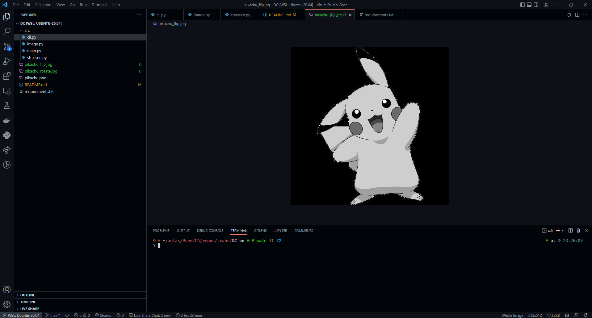
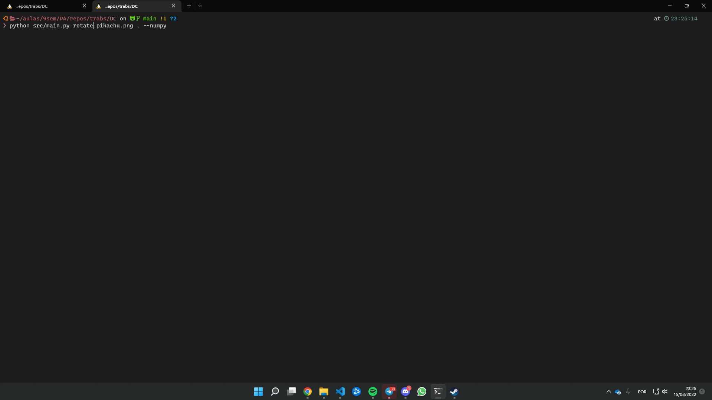
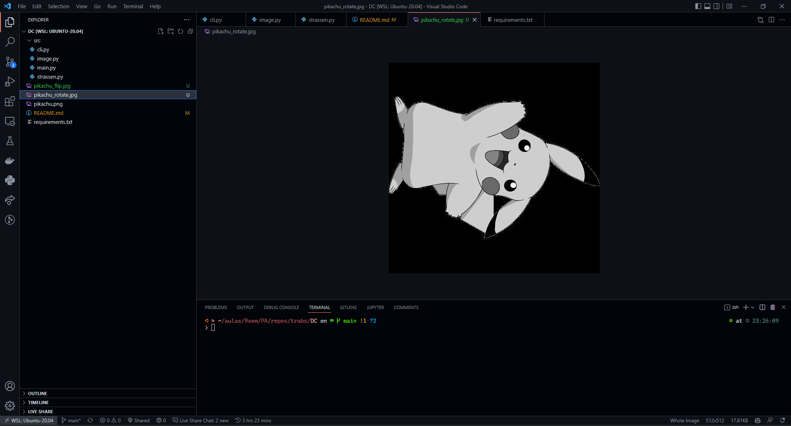

# Image Manipulator

**Conteúdo da Disciplina**: Greed<br>

## Alunos
| Matrícula | Aluno |
| -- | -- |
| 18/0018728  |  Igor Batista Paiva |
| 18/0028260  |  Thiago Aparecido Lopes Santos |

## Sobre
O Image é um software de manipulação de imagens a partir de multiplicação de matrizes.

No software, existem duas opções de manipulação:
 - Flip:
 Nessa opção, a imagem é espelhada

 - Rotate:
Nessa opção, a imagem é rotacionada 90º à esquerda

[Vídeo da apresentação](https://github.com/projeto-de-algoritmos/DivideAndConquer_Image_Manipulator/blob/4c8389d886dbf8fbf28377fedf1f55a3b8ed1c9f/apresentacao.mp4)

## Screenshots
### Rodando o comando flip


### Resultado do comando flip


### Rodando o comando rotate


### Resultado do comando rotate


## Instalação
**Linguagem**: Python<br>
Para executar, primeiramente é necessário ter o [pip3](https://pypi.org/project/pip/) e o [python3](https://www.python.org/downloads/) instalados.

Posteriormente, execute:

```
pip3 install -r requirements.txt
```

para a instalação das dependências e:

```
python3 /src/main.py <comando>
```

para rodar programa para o *comando* desejado.

Obs.: *Os comandos disponíveis serão apresentados na seção abaixo*

## Uso

Para espelhar uma imagem:

```
python3 /src/main.py flip [ filepath ] [ outputpath ] [ --numpy ]
```

Para rotacionar uma imagem:

```
python3 /src/main.py rotate [ filepath ] [ outputpath ] [ --numpy ]
```

Onde:

filepath = caminho da imagem a ser manipulada

outputpath = caminho de destino da imagem manipulada

--numpy = utilizar algoritmo de multiplicação do numpy

Exemplos:

python3 /src/main.py rotate pikachu.png . --numpy

python3 /src/main.py flip pikachu.png .

## Observações

Por razões de escopo, convertemos a imagem para preto e branco para que seja uma representação de uma matriz quadradada com as dimensões da imagem.

Adicionamos uma imagem do pikachu para exemplo.
